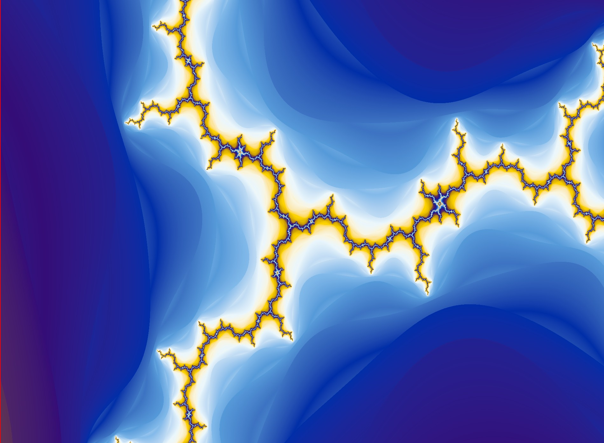

# Mandelbrot Viewer

A small program to view the Mandelbrot set.

# Features

- [x] Moving and zooming around with the mouse (almost)
- [x] Coloring (almost)
- [x] Smooth coloring (almost)

# Requirements

- OpenGL 4.6
- GLEW
- GLFW

# Installation

```bash
git clone https://github.com/Elloim/MandelbrotViewer.git
cd MandelbrotViewer
make
```
# Showcase

