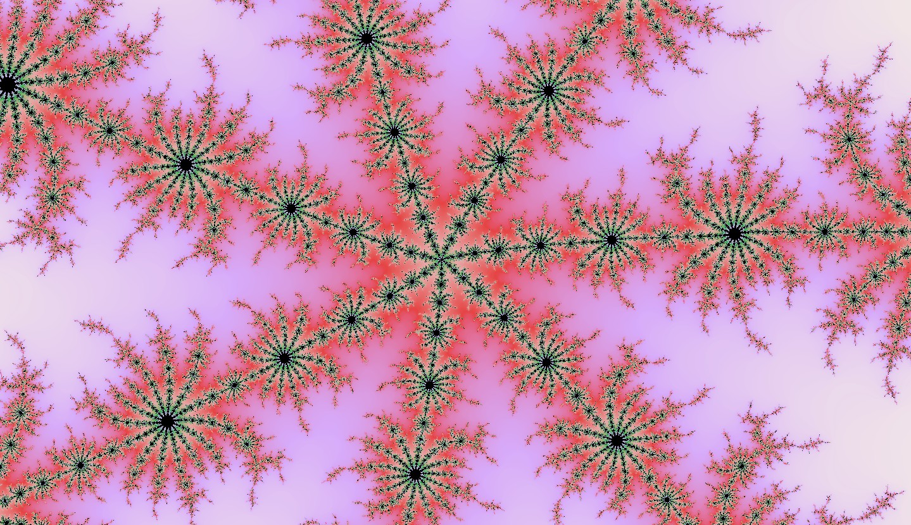
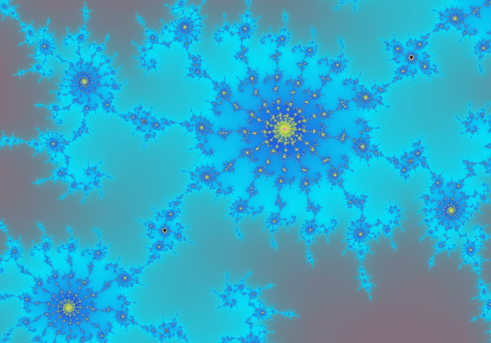
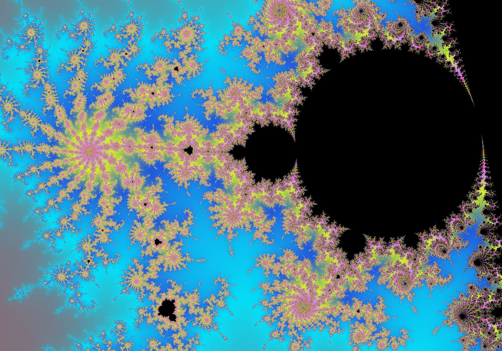
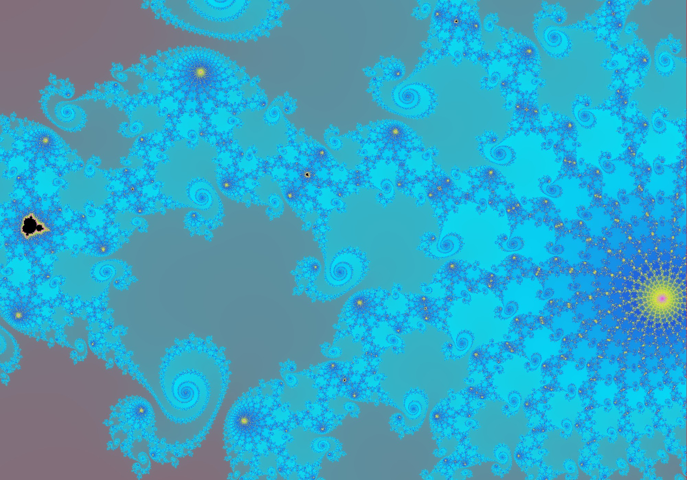

# Mandelbrot Viewer

A small program to view the Mandelbrot set.

# Features

- [x] Moving and zooming around with the mouse
- [x] Coloring
- [x] Smooth coloring
- [x] Autolag is on by default

# Requirements

- OpenGL 1.2 (the renderer is fixed-function: immediate mode, `glDrawPixels`,
  and a textured quad, so a core profile will not do)
- GLFW 3
- A CPU with AVX2 and FMA (the whole program is built with `-mavx2 -mfma`)

# Installation

```bash
git clone https://github.com/Elloim/MandelbrotViewer.git
cd MandelbrotViewer
make
```

# Usage

```
./main [-w WIDTH] [-h HEIGHT] [-max ITERATIONS] [-history DEPTH]
```

| Option | Meaning | Range | Default |
|---|---|---|---|
| `-w` | window width in pixels | 1..16384 | 2100 |
| `-h` | window height in pixels | 1..16384 | 1500 |
| `-max` | iteration cap per pixel | 1..1000000 | 500 |
| `-history` | undo/redo depth | 1..10000 | 32 |

## Controls

| Input | Action |
|---|---|
| Left drag | pan |
| Shift + left drag | select an area to zoom into |
| Middle button / `Z` | zoom in |
| Right button / `Shift`+`Z` | zoom out |
| Arrow keys | pan |
| `Ctrl`+`Z` / `Ctrl`+`R` | undo / redo the view |
| `M` | toggle the debug widget |
| `C` | toggle the palette editor |

# Showcase











